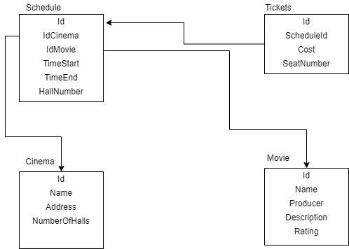

# SimbirSoft Lecture 3 | ASP.NET Core 3.1 

## Task

- Спроектировать создаваемую БД (можно сразу начать с ERD в Visio или draw.io).
- Реализовать доменные модели.
- Реализовать DbContext.
- Прикрепить скриншот ERD в readme.
- Реализовать DTO и маппинги.
- Реализовать по 2-3 репозитория и сервиса. (Если репозитории и сервисы работают со связанными сущностями, продумать реализацию и поведение – в качестве факультатива)
- Реализовать модели запросов и ответов + маппинги.
- Реализовать контроллеры.

Исходники с лекции: https://github.com/simlections/AspNetLection

Условия: репозиторий по gitflow, проект в репозитории github с задачами, краткое readme в github, мержи через pull request. Не забываем про codestyle.

## Description

Предметная область API кинотеатр

## ERD

## Fixed Vulnerabilities

1. CORS политика, были ограничены запросы только доменом "localhost"
2. DUHK уязвимость, ConnectionString был добавлен в "dotnet user-secrets" под Id "916b2489-920e-442c-9d73-aeab4cd25dbc"